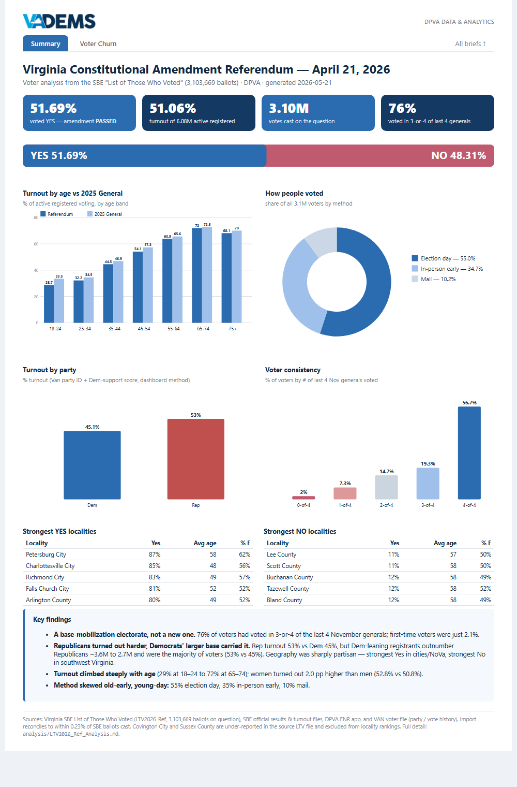
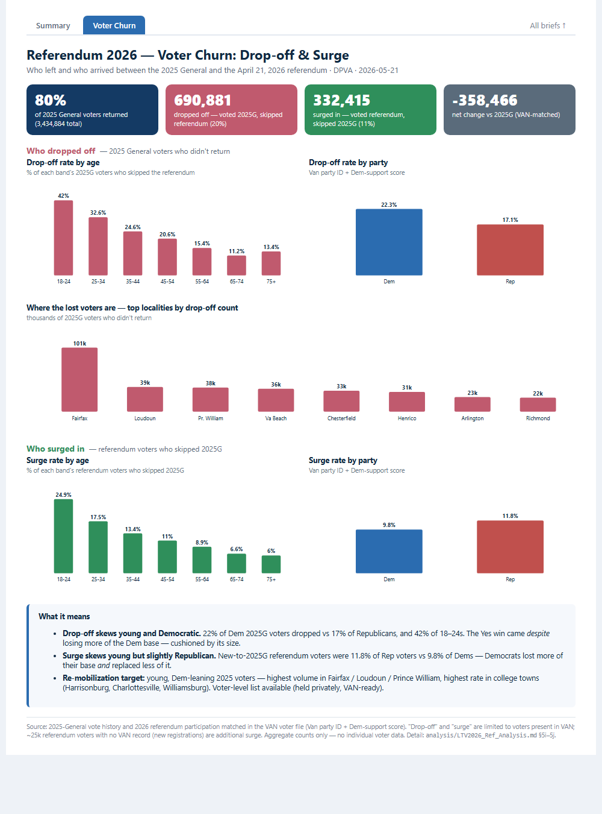

# Referendum 2026

Project home for the **April 21, 2026 Virginia Constitutional Amendment Referendum**
data work (DPVA). This repo is **documentation and project-level SQL/analysis only** —
the operational pipelines stay in their original locations (`C:\Scripts\Python\...`)
because Task Scheduler depends on those paths.

## Top-line result
Amendment **PASSED, 51.69% Yes / 48.31% No**, on **51.06% turnout** (3.1M voters).

## Visual summary (one-page brief)
**Live page:** https://referendum-2026.vadems.org/



Ready-to-share **PDF**: [`analysis/Referendum2026_Summary.pdf`](analysis/Referendum2026_Summary.pdf) ·
interactive HTML source: [`analysis/Referendum2026_Summary.html`](analysis/Referendum2026_Summary.html) ·
full written analysis: [`analysis/LTV2026_Ref_Analysis.md`](analysis/LTV2026_Ref_Analysis.md).

### Companion brief — voter churn (drop-off & surge)
Who the 2025 electorate lost (690,881 dropped off) and gained (332,415 surged in) by April 2026:



PDF: [`analysis/Referendum2026_Churn_Brief.pdf`](analysis/Referendum2026_Churn_Brief.pdf) · HTML: [`analysis/Referendum2026_Churn_Brief.html`](analysis/Referendum2026_Churn_Brief.html) · detail in `LTV2026_Ref_Analysis.md` §5i–5j. _(Voter-level targeting list held privately, not in this repo.)_

## Contents
| Path | What |
|------|------|
| `INVENTORY.md` | Master inventory — scripts, SQL objects, data files, repos, URLs, tasks (source of truth) |
| `CLAUDE.md` | Standing context for Claude Code |
| `sql/` | DDL + build scripts for this election's tables (`LTV2026_Ref`, `LTV2026_Ref_Votemethod`, quote cleanup) |
| `analysis/` | Phase 4 reconciliation + Phase 5 voter-pattern analysis (`.md`, `.xlsx`, scripts) |
| `notes/` | Verification SQL, Task Scheduler export, working notes |
| `handoff/` | Backup zips / archive manifests |

## Pipeline (six phases)
0. Build inventory → 1. Inspect LTV source → 2. Load `Historic.dbo.LTV2026_Ref` (3,101,912 rows)
+ derived vote-method → 3. Quote cleanup → 4. Reconcile vs SBE/ENR/Absentee
→ 5. Voter pattern analysis (5a–5h) → 6. Executive summary + inventory.

## Key SQL objects (on `INSTANCE-1`)
- `Historic.dbo.LTV2026_Ref` — raw LTV load (50 cols)
- `Historic.dbo.LTV2026_Ref_Votemethod` — derived Polls / AB_Inperson / AB_Mail / AB_Other
- `Historic.dbo.LTV2026_Ref_Base` — analysis base (LTV ⋈ Van ⋈ RVL)

## Reproduce
```
python C:\Scripts\Python\Python_LTWV\load_LTV2026_Ref.py   # load
python analysis\reconcile.py                                # Phase 4
python analysis\analyze.py                                  # Phase 5 (rebuilds base + report/xlsx)
```
> `analyze.py` regenerates the Phase 5 body of `LTV2026_Ref_Analysis.md`; the Phase 6
> executive summary at the top is hand-authored — preserve it if regenerating.
